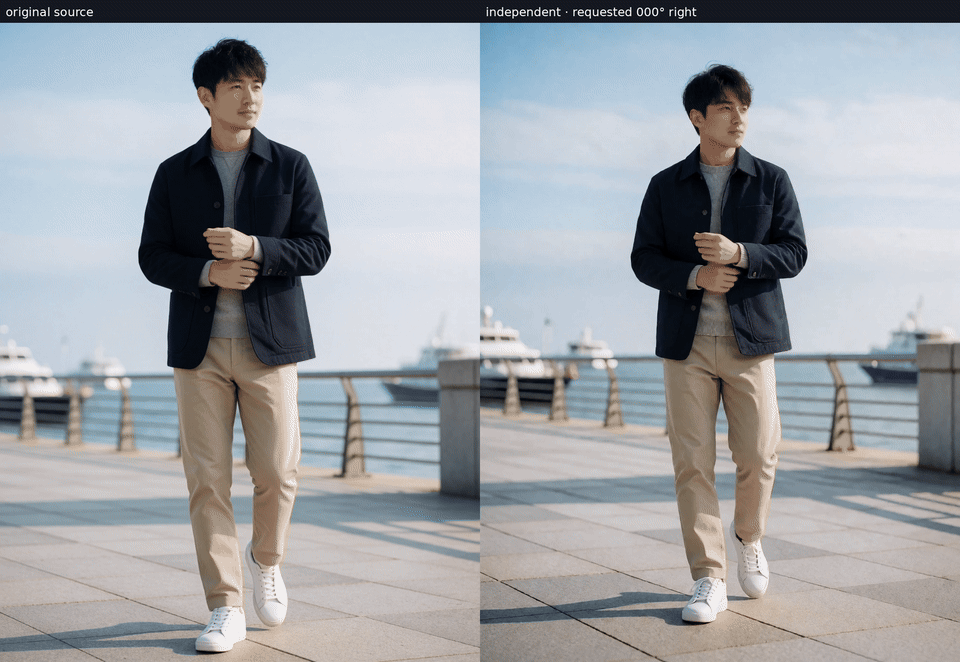

# ComfyUI Krea 2 Anygles

Native ComfyUI nodes for the
[`yijunwang2/krea2-anygles`](https://huggingface.co/yijunwang2/krea2-anygles)
functional adapter. Anygles turns one human image into a controlled horizontal,
elevated, lowered, closer, or farther camera view.

[Model card and portable Diffusers example](https://huggingface.co/yijunwang2/krea2-anygles)
| [Krea 2 functional adapters collection](https://huggingface.co/collections/yijunwang2/krea-2-functional-adapters-6a700e9e5c134888d6615a5d)



## Install

```bash
cd ComfyUI/custom_nodes
git clone https://github.com/alexw5702-afk/krea2-anygles
cd krea2-anygles
pip install -r requirements.txt
```

Accept the SAM 3D Body license and download its complete checkpoint repository:

```bash
hf download facebook/sam-3d-body-dinov3 \
  --local-dir ComfyUI/models/sam3d_body
```

Restart ComfyUI and place `krea2_anygles_rank32.safetensors` in
`ComfyUI/models/loras`.

## Requirements

- A current ComfyUI build with native Krea 2 support.
- [`krea2_turbo_int8_convrot.safetensors`](https://huggingface.co/Comfy-Org/Krea-2/blob/main/diffusion_models/krea2_turbo_int8_convrot.safetensors)
  in `ComfyUI/models/diffusion_models`.
- [`qwen3vl_4b_fp8_scaled.safetensors`](https://huggingface.co/Comfy-Org/Krea-2/blob/main/text_encoders/qwen3vl_4b_fp8_scaled.safetensors)
  in `ComfyUI/models/text_encoders`.
- [`qwen_image_vae.safetensors`](https://huggingface.co/Comfy-Org/Krea-2/blob/main/vae/qwen_image_vae.safetensors)
  in `ComfyUI/models/vae`.
- [Krea 2 Anygles LoRA](https://huggingface.co/yijunwang2/krea2-anygles/blob/main/krea2_anygles_rank32.safetensors)
  in `ComfyUI/models/loras`.
- `facebook/sam-3d-body-dinov3` under `ComfyUI/models/sam3d_body`, including
  `model.ckpt`, `model_config.yaml`, and `assets/mhr_model.pt`.

MoGe is installed from its pinned upstream revision by `requirements.txt` and
downloads its public FOV model on first use.

## Nodes

### Krea2 Anygles Camera

Takes one source image plus yaw, elevation, distance, and optional user text.
It aligns the source canvas, recovers one human mesh, rotates around the pelvis,
renders the target normal, and produces the complete camera prompt.

The node deliberately unloads resident Comfy models before SAM 3D Body runs and
releases SAM before Krea 2 sampling begins. This avoids keeping both large model
families on the GPU at once.

### Krea2 Anygles Encode

Encodes the source twice according to the validated inference contract:

- a maximum-edge-384 clean Krea 2 reference and optional Qwen3-VL image input;
- a full-canvas VAE latent of the aligned target normal.

It returns the positive conditioning and one `ANYGLES_CONTROL` object for the
model patch.

### Krea2 Anygles Load LoRA

Loads the regular adapter tensors into Krea 2 and retains
`transformer.first_control.weight` separately. An ordinary LoRA loader skips
that spatial projection and therefore cannot reproduce the model.

### Krea2 Anygles Model Patch

Injects target-normal tokens through the spatial projection at the noisy image
input. The clean source reference is processed at timestep zero and its K/V is
cached once per sampling run.

## Workflow

Drag [`krea2_anygles_workflow.json`](krea2_anygles_workflow.json) into ComfyUI.
The important wiring is:

```text
Load Image -> Anygles Camera -> Anygles Encode
Load Diffusion Model -> Anygles Load LoRA -> Anygles Model Patch -> KSampler
Anygles Encode.positive -> KSampler.positive
Anygles Camera.width/height -> EmptySD3LatentImage -> KSampler.latent_image
KSampler -> VAE Decode -> Save Image
```

Recommended Krea 2 Turbo settings: 8 steps, Euler, simple scheduler, CFG 1.0,
LoRA strength 1.0, 384px source reference, VLM reference enabled, and reference
K/V cache enabled.

This graph was validated end to end at 1008×1344 with the three linked
Comfy-Org model files, the published Anygles adapter, SAM 3D Body normal
preparation, and the recommended eight-step sampler settings. The raw workflow
output is the model decode; no final source composite is applied.

Yaw is relative to the input: negative values move left and positive values
move right. Negative elevation moves the camera downward; positive elevation
moves it upward. Distance below 1 moves closer and distance above 1 moves
farther away. Optional text is appended after the generated camera instruction.

## Current scope

The model supports one clear human subject. It is not designed for animals,
general objects, crowds, or exact 3D scene reconstruction. Hidden surfaces and
background details are generated and can change at large camera movements.

## Credits and license

Reference-attention and K/V-cache code is adapted from
[`RealRebelAI/ComfyUI-Rebels-Krea2-Outpaint`](https://github.com/RealRebelAI/ComfyUI-Rebels-Krea2-Outpaint)
and [`ostris/ComfyUI-Krea2-Ostris-Edit`](https://github.com/ostris/ComfyUI-Krea2-Ostris-Edit).
See `NOTICE` for the attribution chain.

Custom node code is MIT licensed. Vendored SAM 3D Body inference source remains
under `SAM_LICENSE`. The separately downloaded Anygles LoRA is a Krea 2
derivative and remains subject to the Krea 2 Community License.
